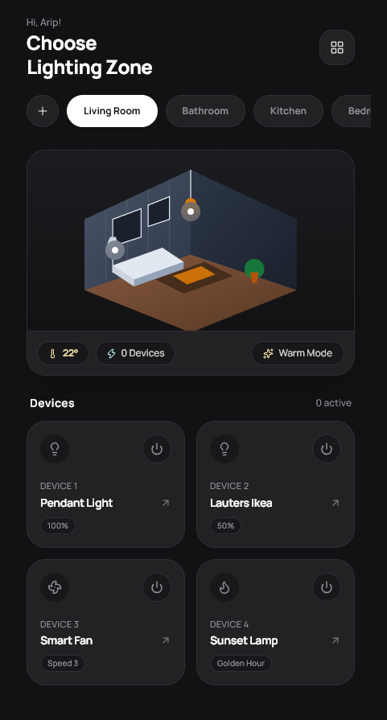
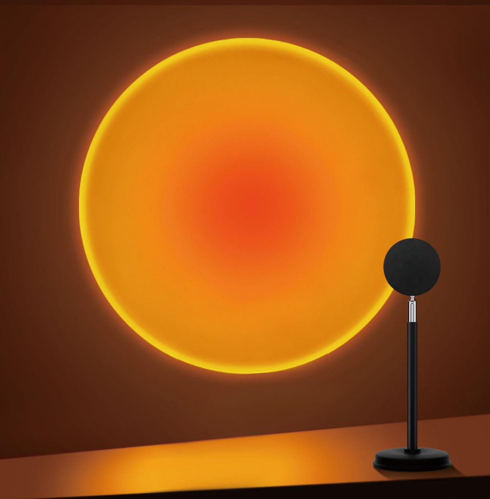
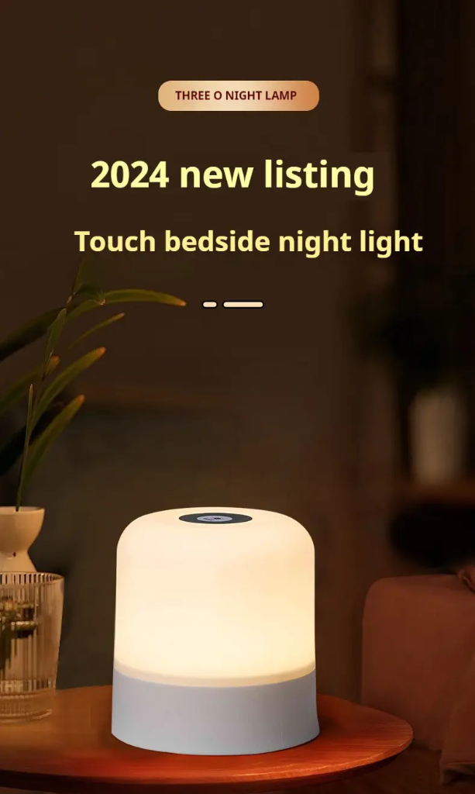

# IRemote 📡✨

A minimal, luxury smart remote control app designed for the **Poco X7 Pro** hardware IR Blaster. Seamlessly controls your **Sunset Projector Lamp**, **Three O Touch Bedside Night Lamp**, and **Smart Fan** with tactile haptics, an upward rainbow arc dial, aesthetic color pickers, and live 3D room feedback.

[](https://github.com/officiallygod/IRemote/actions/workflows/deploy-pages.yml)
[](https://github.com/officiallygod/IRemote/actions/workflows/build-apk.yml)
[](LICENSE)

🌐 **Live Web Preview**: [https://officiallygod.github.io/IRemote/](https://officiallygod.github.io/IRemote/)

---

## 📸 Real Devices & App Previews

<div align="center">
  <table>
    <tr>
      <td align="center"><b>App Dashboard & 3D Dorm Room</b></td>
      <td align="center"><b>Sunset Projector Lamp</b></td>
      <td align="center"><b>Three O Bedside Night Lamp</b></td>
    </tr>
    <tr>
      <td></td>
      <td></td>
      <td></td>
    </tr>
  </table>
</div>

---

## ⚡ Features

### 1. 🛏️ 3D Isometric Dorm Room
* **Modeled after Allen's actual room layout**:
  * **Study Desk**: Positioned along the left wall with an open laptop and the **Sunset Lamp** sitting on it.
  * **Window**: Located directly beside the study desk with sunlight streaming onto the wood floor.
  * **Bed & Nightstand**: Cozy bed on the right wall with a nightstand holding the **Three O Bedside Touch Lamp**.
  * **Interactive Hotspot Pins**: Tap lamps directly in the 3D room to toggle them on/off with real-time room lighting effects.
  * **Clean Status Badges**: Shows live temperature (`22°`) and active device count.

### 2. 🌅 Sunset Projector Lamp
* **Authentic Solar Projection**: Projects a high-contrast circular golden-orange sun halo with a crimson radiant core directly onto the wall.
* **Mood Presets**: Instant one-tap switches for *Golden Hour*, *Deep Sunset*, *Twilight Violet*, and *Nordic Sky*.
* **Dimmer Dial**: Smooth upward arc slider for 0–100% intensity adjustments.

### 3. 🌙 Three O Touch Bedside Night Lamp
* **Translucent Frosted Dome**: Diffuses soft 2700K warm candlelight or rich RGB mood tones.
* **Touch Sensor Circle**: Direct on-screen power toggle simulating the real bedside lamp's capacitive ring.

### 4. 🌀 Smart Fan Controller
* **Poco X7 Pro Hardware Codes**: Integrated exact NEC 38kHz codes:
  * **Power On/Off**: `0x00FF58A7`
  * **Wind Speed (3 Speeds)**: `0xC03FC03F` via the Arc dial
  * **Oscillation Swing**: `0x926DE01F`
  * **Timer (Off, 1h, 2h, 4h, 8h)**: `0x00FF906F`
  * **Wind Mode (Normal, Breeze, Sleep)**: `0x5D05807F`
* **Animated Blade Hub**: Real-time rotating blades synchronized to the selected speed.

### 5. 🎨 Aesthetic Color System & Key Matrix
* **360° Radial Color Wheel**: Continuous color picker that automatically translates any hue into the closest 38kHz NEC remote code.
* **24-Key China Remote Matrix**: Complete tactile grid with Red, Green, Blue, 12 shades, and dynamic modes (Flash, Strobe, Fade, Smooth).
* **IR Key Manager**: Save, test, and blast any custom 32-bit hex code anytime.

### 6. ☀️ Light & Dark Mode
* Header toggle for switching between sunny aesthetic light mode and deep matte black luxury dark mode.

---

## 🛠️ Tech Stack & Architecture

* **Frontend**: React 18, TypeScript, Vite
* **Styling & Animations**: Tailwind CSS, Framer Motion, Manrope typography
* **Cross-Platform Container**: Capacitor (`@capacitor/core`, `@capacitor/android`, `@capacitor/haptics`)
* **Hardware Infrared Layer**:
  * Native Kotlin/Java plugin calling `android.hardware.ConsumerIrManager`
  * Generates alternating microsecond mark/space arrays for 38.0 kHz carrier frequency
  * Full web fallback with virtual diode beam HUD and signal inspector

---

## 📱 How to Build the Standalone Android APK

### Option A: Automatic Cloud Build (Zero Setup)
Every time code is pushed to GitHub, **GitHub Actions** compiles the APK automatically:
1. Go to the **Actions** tab on your repository.
2. Select the latest **Build Android APK** workflow run.
3. Download `IRemote-Debug-APK.zip` under **Artifacts**.
4. Extract and install `app-debug.apk` directly on your Poco X7 Pro!

### Option B: Local Android Studio Build
```bash
# 1. Install dependencies
npm install

# 2. Build production web bundle
npm run build

# 3. Sync to native Android project
npx cap sync android

# 4. Open in Android Studio
npx cap open android
```
In Android Studio: click **Build > Build Bundle(s) / APK(s) > Build APK(s)**.

---

## 💻 Local Development

```bash
# Start local development server
npm run dev
```
Open [http://localhost:5173](http://localhost:5173) in your browser.

---

## 📄 License
MIT © Allen (officiallygod)
