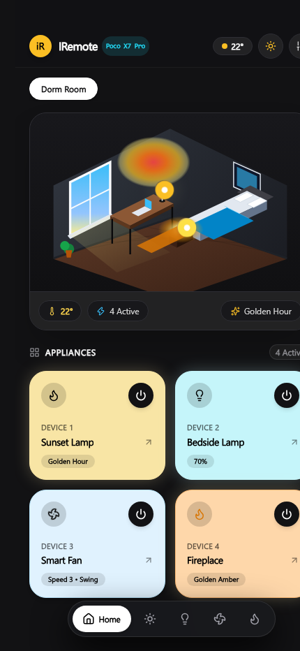
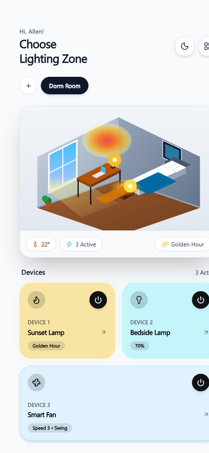
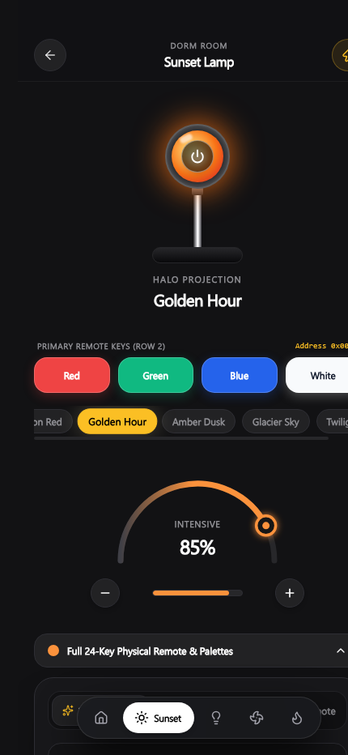
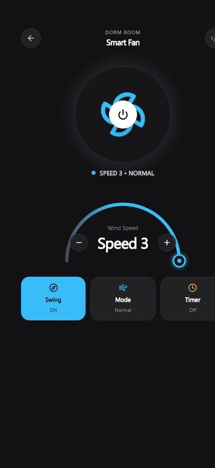
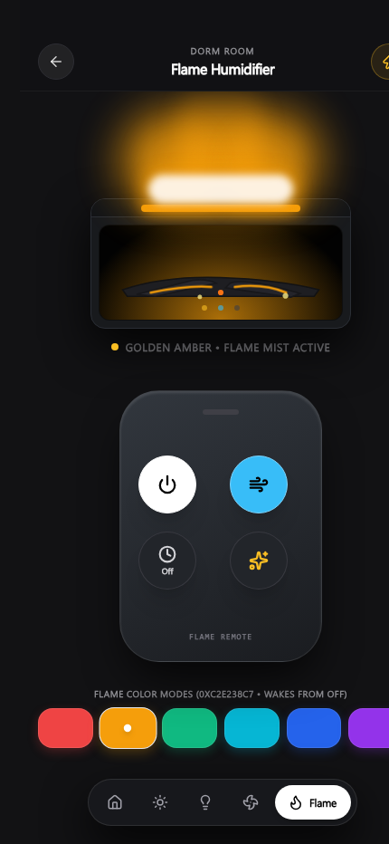

# IRemote

A modern, minimal infrared smart control application architected for the Poco X7 Pro hardware IR Blaster. Provides direct hardware pulse transmission via Android ConsumerIrManager, dual light/dark themes, an upward rainbow arc gauge, aesthetic color wheels, and a 3D isometric dorm room view.

[](https://github.com/officiallygod/IRemote/actions/workflows/build-apk.yml)
[](https://github.com/officiallygod/IRemote/actions/workflows/deploy-pages.yml)
[](https://nodejs.org/)
[](https://react.dev/)
[](https://www.typescriptlang.org/)
[](https://vitejs.dev/)
[](https://capacitorjs.com/)
[](https://tailwindcss.com/)
[](https://developer.android.com/)
[](LICENSE)

Live Web Preview: [https://officiallygod.github.io/IRemote/](https://officiallygod.github.io/IRemote/)

---

## Interface Overview

### Dark Mode vs Light Mode

<div align="center">
  <table>
    <tr>
      <th align="center">Dark Mode (Dorm Room)</th>
      <th align="center">Light Mode (Dorm Room)</th>
    </tr>
    <tr>
      <td align="center"></td>
      <td align="center"></td>
    </tr>
  </table>
</div>

### Device Control Screens

<div align="center">
  <table>
    <tr>
      <th align="center">Sunset Lamp Controller</th>
      <th align="center">Smart Fan Controller (3 Speeds)</th>
    </tr>
    <tr>
      <td align="center"></td>
      <td align="center"></td>
    </tr>
    <tr>
      <th align="center" colspan="2">Fireplace Flame Humidifier Controller</th>
    </tr>
    <tr>
      <td align="center" colspan="2"></td>
    </tr>
  </table>
</div>

---

## Architecture & System Features

### 1. Interactive IR Key Hunter & Candidate Scanner
* Built-in interactive code hunter for discovering unmapped power and color toggle commands.
* **Fireplace Matrix**: Scans Address `0xC2E2` candidates (`0x18`, `0x08`, `0x58`, `0x78`, `0x88`, `0xB8`, `0xD8`, `0xF8`, etc.) with 1-tap test and persistent storage in `localStorage`.
* **Sunset Lamp Matrix**: Tests Address `0x00F7`, `0x00FF`, `0x00EF` power toggle and OFF codes.
* Auto-scan engine cycling through codes with pause/resume and one-touch confirmation.

### 2. Modern App UI & Layout Architecture
* **Persistent Top Navigation Bar**: Frosted glass header (`sticky top-0 z-30 backdrop-blur-xl`) with safe-area spacing that remains completely stable while content scrolls smoothly underneath.
* **Floating Bottom Pill Dock**: Inspired by luxury smart home control centers with quick-switching across Dashboard, Sunset Lamp, Bedside Lamp, Fan, and Fireplace.
* **Dynamic Island Capsule Toast**: Floating top banner with pulsing transmitter diode waveform, device name badge, action description, and hex readout.
* **Reliable Theme Persistence**: Dark/Light mode preference synced immediately to `localStorage` and `<html>` class list.

### 3. Fireplace Flame Humidifier & Diffuser (4-Button Pebble Remote)
* Direct integration of verified NEC codes from IrCode Finder:
  * **Toggle Fireplace Light Effect**: `0xC2E238C7` (Cycles 6 authentic flame colors and wakes device from off state)
  * **Switch Fog Light Effect**: `0xC2E29867` (Toggles rising flame fog mist)
  * **Timer**: `0xC2E27887` (Cycles 1h, 3h, 5h, ON)
* Visual animated fireplace box with charred log silhouettes, pulsing glowing ember cracks, and illuminated water mist flames.

### 4. Physical 24-Key Remote Replica
* 1:1 tactile digital replica of the physical white 24-key remote with address switcher (`0x00F7`, `0x00EF`, `0xFF00`).
* Direct Row 2 primary color buttons (**Red**, **Green**, **Blue**, **White**) mounted directly on the Sunset Lamp controller.

### 1. Hardware Infrared Transmission Layer
* Native Android plugin interfacing with `android.hardware.ConsumerIrManager`.
* Real-time 32-bit NEC protocol pulse encoder converting hexadecimal commands into 38.0 kHz microsecond timing arrays (alternating marks and spaces).
* Virtual infrared diode HUD for real-time signal inspection, frequency validation, and timing analysis.

### 2. 3D Isometric Dorm Room
* Accurate architectural model featuring a study desk positioned beside an exterior window with daylight ray casting.
* Interactive touch hotspots mapped directly to the Sunset Projector Lamp and Three O Touch Bedside Lamp.
* Real-time status readouts including ambient temperature and active appliance counts.

### 3. Sunset Projector Lamp Controller
* High-contrast circular solar halo projection modeling real optical dispersion.
* Presets for Golden Hour, Deep Sunset, Twilight Violet, and Nordic Sky.
* Upward rainbow arc dial gauge for 0-100% dimmer control without UI overlap.

### 4. Three O Bedside Touch Night Lamp
* Diffuse cylindrical dome lighting model supporting 2700K warm candlelight and dynamic RGB hues.
* Capacitive touch ring simulation for immediate on/off toggling.

### 5. Smart Fan Controller
* 3-speed arc dial configuration (Speed 1, Speed 2, Speed 3).
* Integrated NEC codes for Poco X7 Pro hardware:
  * Power On/Off: `0x00FF58A7`
  * Wind Speed: `0xC03FC03F`
  * Oscillation Swing: `0x926DE01F`
  * Timer: `0x00FF906F`
  * Wind Mode: `0x5D05807F`

### 6. Custom IR Key Manager
* Interactive blank key generator allowing custom key naming, hex code specification, and live hardware test firing.
* Complete 24-key matrix for RGB LED strips and continuous 360-degree color wheel mapping.

---

## Android APK Generation

### Method A: Automated GitHub Actions Build (Recommended)
This repository includes a continuous integration workflow that packages the debug APK on every commit using Node.js 22 and Java 21:
1. Navigate to the **Actions** tab in this GitHub repository.
2. Open the latest run for **Build Android APK**.
3. Under **Artifacts**, download `IRemote-Debug-APK`.
4. Transfer and install `app-debug.apk` on your Poco X7 Pro.

### Method B: Local Android Studio Build
```bash
# 1. Install dependencies
npm install

# 2. Compile production bundle
npm run build

# 3. Synchronize Capacitor assets
npx cap sync android

# 4. Open in Android Studio
npx cap open android
```
Within Android Studio, select **Build > Build Bundle(s) / APK(s) > Build APK(s)** to generate `android/app/build/outputs/apk/debug/app-debug.apk`.

---

## Local Development Server

```bash
# Install packages
npm install

# Launch development server
npm run dev
```
Open [http://localhost:5173](http://localhost:5173) in any standard browser.

---

## License
MIT License. Copyright (c) Allen (officiallygod).
